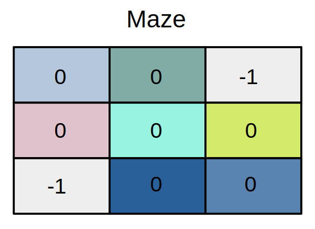
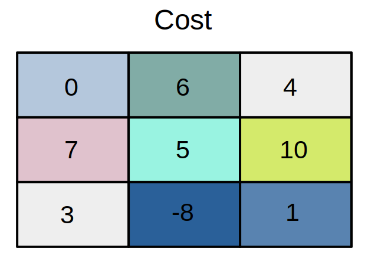

# Maze-Game
Maze game is a well-known problem, where we are given a grid of 0’s and 1’s, 0’s corresponds to a place that can be traversed, and 1 corresponds to a place that cannot be traversed (i.e. a wall or barrier); the problem is to find a path from bottom left corner of grid to top right corner; immediate right, immediate left, immediate up and immediate down only are possible (no diagonal moves). We consider a variant of the maze problem where a cost (positive value) or profit (negative value) is attached to visiting each location in the maze, and the problem is to find a path of least cost through the maze.
One may solve the problem after imposing/relaxing other restrictions on the above problem on ---

- Values of cost/profit (but not same cost/profit for all traversable cells in the grid
- Moves possible (but you cannot trivialize the problem by making the grid linear or partly linear in any way
- No. of destinations possible

The task is to choose the most efficient algorithm possible for the specific case.

 

## Approach
Convert the maze to a weighted graph G (V, E). Each location (i, j) in the maze corresponds to a *node* in the graph. The problem can have multiple solutions. One can use any design technique such as greedy method, backtracking, dynamic programming and choose their own conditions, positive or negative costs for the graph.
According to thequestions, a cost is attached to visiting each node. So the **cost of visiting node[j] is equivalent to cost_matrix[j].**

Let us consider a simple maze along with its cost matrix.

 

**Assuming all 0s as vertices and taking the top left corner as the source vertex, the resulting graph would look like:**

<kbd>
  
</kbd>

Once we have identified our edges, we create a **vector object of structure** which is of the form shown below and **push all the edges and associated cost into it.**

#### struct Edge {  
#### &nbsp;&nbsp;&nbsp;&nbsp;int source, dest, cost;  
#### };

## Proposed Method
We must find the **'single source shortest path'**, with one vertex in a directed weighted graph as source and find shortest path to all other vertices. The presence of negative edges prevents us from using the **Dijkstra's Algorithm** as it does not give a correct solution in case of negative edges. 
However, we may use the **'Bellman-Ford Algorithm'** for our purpose. The **'Bellman-Ford Algorithm'** assumes one vertex as the source and finds the shortest path to all other vertices even when negative edges are present, i.e. finds the path with minimum cost. 

### The Bellman-Ford Algorithm
Bellman–Ford proceeds by **relaxation**, in which approximations to the correct distance are replaced by better ones until they eventually reach the solution. The Bellman–Ford algorithm simply relaxes all the edges, and does this **|V|-1 times**, where *|V| is the number of vertices* in the graph. In each of these repetitions, the number of vertices with correctly calculated distances grows, from which it follows that eventually all vertices will have their correct distances.

The algorithm initializes the distance to the source to 0 and all other nodes to infinity. Then for all edges, if the distance to the destination can be shortened by taking the edge, the distance is updated to the new lower value. At each iteration i that the edges are scanned, the algorithm finds all shortest paths of at most length i edges (and possibly some paths longer than i edges). Since the longest possible path without a cycle can be |V|-1 edges, the edges must be scanned |V|-1 times to ensure the shortest path has been found for all nodes. A final scan of all the edges is performed and if any distance is updated, then a path of length |V| edges has been found. The Bellman-Ford Algorithm is a **dynamic programming** approach.  

**Time complexity**: **O(VxE)** where V and E are total number of vertices and edges respectively.  
Assuming V and E as n the time complexity is calculated to be **O(n2)**. The worst case time is however calculated to be **O(n3)** which occurs in case of a *complete graph*.

## Usage Guidelines
- Cloning the Repository: 

        git clone https://github.com/am9964/Maze-Game
- Entering The directory: 

        cd Maze-Game
- Compiling the program:

         g++ -std=c++11 maze.cpp
- Running the file:
        
        ./a.out
- Stopping from the terminal:

        Ctrl+C

## Result:
Upon running the commands on the terminal and entering values mentioned in the above graph, we got the following output:

## Reference:
- <a href = "https://youtu.be/FtN3BYH2Zes">Bellman Ford Algorithm - Single Source Shortest Path - Dynamic Programming</a>
- <a href = "https://www.geeksforgeeks.org/bellman-ford-algorithm-dp-23/">Bellman–Ford Algorithm | DP-23</a>
- <a href = "https://en.wikipedia.org/wiki/Bellman%E2%80%93Ford_algorithm">Bellman–Ford algorithm - Wikipedia</a>
- <a href = "https://stackoverflow.com/questions/19482317/bellman-ford-vs-dijkstra-under-what-circumstances-is-bellman-ford-better#:~:text=Bellman%2DFord%20algorithm%20is%20a,Algorithm%20can%20only%20handle%20positives.">Bellman-Ford vs Dijkstra</a>
- <a href = "https://www.educative.io/module/lesson/python-arrays/7D4X7vLAOBG">Find shortest path in a maze (Bellman-Ford approach)</a>
